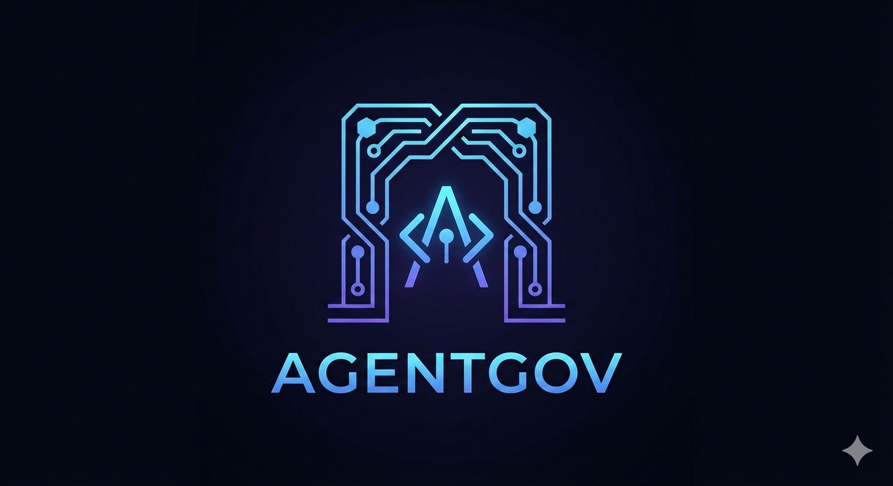

# AgentGov

 #AI

Self-improving governance framework for AI agents. Portable, token-efficient standards that chain-load on demand.

## What This Is

- Defines canonical governance artifacts for AI agent behavior and safety
- Designed for downstream projects to ingest and reuse without modification
- Emphasizes explicit planning (Spec Protocol) and consent gating for any user-facing or breaking change

## Core Artifacts

- Persona and project context: [PERSONA.md](PERSONA.md), [PROJECT_CONTEXT.md](PROJECT_CONTEXT.md)
- Governance pillars: [SPEC_PROTOCOL.md](SPEC_PROTOCOL.md), [STANDARDS_CORE.md](STANDARDS_CORE.md), [STANDARDS_ORCHESTRATION.md](STANDARDS_ORCHESTRATION.md)
- Language standards: [STANDARDS_BASH.md](STANDARDS_BASH.md), [STANDARDS_POWERSHELL.md](STANDARDS_POWERSHELL.md)
- Change safety: [CONSENT_CHECKLIST.md](CONSENT_CHECKLIST.md), [MIGRATION_TEMPLATE.md](MIGRATION_TEMPLATE.md)
- Maintenance & decisions: [GOVERNANCE_MAINTENANCE.md](GOVERNANCE_MAINTENANCE.md), [ADR_TEMPLATE.md](ADR_TEMPLATE.md)
- Plans (durable specs): [.github/prompts/](.github/prompts)

## How to Use (Agents & Maintainers)

1) Load order (Tier 0): PERSONA → PROJECT_CONTEXT → SPEC_PROTOCOL → STANDARDS_CORE. Language standards load only when relevant code is present.
2) Apply Spec Protocol: For any significant change, draft and persist a plan in `.github/prompts/plan-<YYYYMMDD>-<topic>.prompt.md`, get explicit approval, then implement.
3) Consent Gate: For breaking or user-facing changes, run the checklist in [CONSENT_CHECKLIST.md](CONSENT_CHECKLIST.md) and document migrations with [MIGRATION_TEMPLATE.md](MIGRATION_TEMPLATE.md).
4) Dynamic chain-load: Keep references conditional ("chains to ... when …") to preserve lazy loading and token efficiency.

## Contribution Workflow

- Plans first for significant work; store in [.github/prompts](.github/prompts)
- Record architectural choices as ADRs in `.github/adrs/` using [ADR_TEMPLATE.md](ADR_TEMPLATE.md)
- Maintain rules with the pruning protocol in [GOVERNANCE_MAINTENANCE.md](GOVERNANCE_MAINTENANCE.md)
- Follow language standards when adding scripts; keep CommonMark compliance for docs

## Release Readiness

- Specs and standards are stable; use Spec Protocol and Consent Gate for any final adjustments
- Keep README, standards, and plans aligned to avoid context drift across consuming projects
